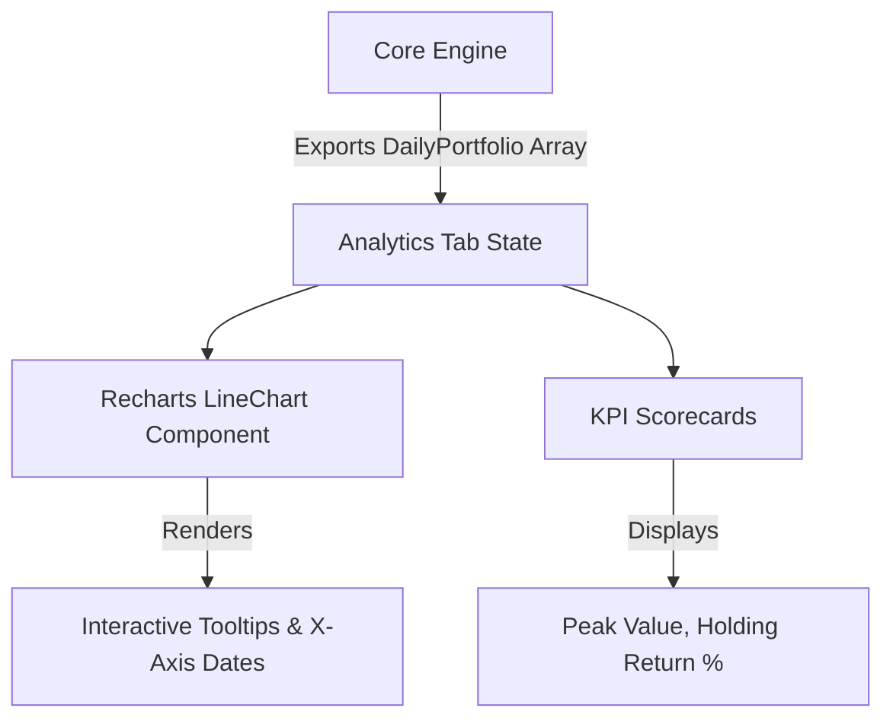

# Analytics & Charts Architecture

The Analytics Sheet (`AnalyticsTab.tsx`) is designed to visually represent the chronological performance data calculated by the Core Engine. It takes the heavy time-series arrays and renders them using the `recharts` library.

## 1. Data Flow



## 2. The Daily Portfolio Array
The backbone of the chart is the `DailyPortfolioEntry[]` array generated by the engine.

Each object in this array represents a single calendar day (including weekends) and contains:
```typescript
{
  date: "2023-10-01",
  totalValue: 15420.50, // Cash + Sum(Stocks)
  cashBalance: 2000.00,
  invested: 13000.00,   // Net negative cash
  holdings: {
    "AAPL": { shares: 50, price: 150.00, value: 7500.00 },
    "MSFT": { shares: 20, price: 296.02, value: 5920.50 }
  }
}
```

## 3. Chart Rendering Logic

The main performance chart uses Recharts to plot a `<LineChart>`:
- **X-Axis:** Maps to the `date` string. We utilize a custom formatter `tickFormatter={(tick) => formatShortDate(tick)}` to convert "YYYY-MM-DD" into readable labels like "Oct '23".
- **Y-Axis:** Maps to the `totalValue`. 
- **Tooltip:** Uses a custom `<Tooltip content={<CustomTooltip />} />` that intercepts hover events and formats the raw numbers into currency (e.g., `$15,420.50`).

## 4. Key Performance Indicators (KPIs)

The KPI scorecards at the top of the analytics tab are mathematically derived as follows:

1. **Current Value:** `dailyPortfolio[dailyPortfolio.length - 1].totalValue`
2. **Total Invested:** `dailyPortfolio[dailyPortfolio.length - 1].invested` (This ignores cash in the account and only looks at fiat actually deployed into assets).
3. **Holding Return:** 
   Calculated by the engine as a comprehensive yield metric.
   ```text
   Holding Return % = ((Current Value + Total Dividends) - Total Invested) / Total Invested * 100
   ```
   *Note: Total Dividends must be added back to the Current Value to accurately reflect the total profit generated by the invested capital.*

4. **Peak Portfolio Value:**
   Calculated by scanning the `totalValue` of every day in the array and storing the maximum integer found.
