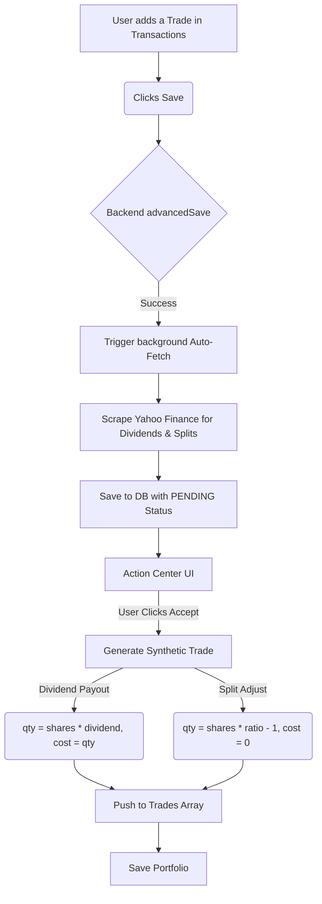

# Part 1 Walkthrough: Corporate Actions & Synthetic Trades

We have successfully overhauled the Portfolio Engine to support explicit Synthetic Trades for Corporate Actions. By decoupling dynamic math from the daily pricing loop, we ensure absolute auditability and user control.

## 1. Architectural Flowchart

## 2. Mathematical Logic & Reconciliation

### The Old System (Dynamic Evaluation)
Previously, the engine would retroactively scale historical trades when it encountered a Split. This caused severe coupling and made it impossible to manually verify the math.

### The New System (Synthetic Trades)
Now, all corporate actions are explicitly injected into the timeline as atomic transactions.

**1. Dividend Payouts**
- **Trigger:** User accepts a `DIVIDEND` action (e.g., $1.50 per share).
- **Calculation:** The UI loops through all trades chronologically up to the dividend ex-date. 
- **Math:** `Shares Held = (Buys + Transfers In + Splits) - (Sells + Transfers Out)`
- **Synthetic Trade Generated:**
  - `Symbol`: `$CASH`
  - `Side`: `Dividend Payout`
  - `Qty`: `Shares Held * $1.50`
  - `Cost Basis`: Cash increases perfectly.

**2. Stock Splits & Bonuses**
- **Trigger:** User accepts a `SPLIT` action (e.g., 4:1 split -> ratio of 4).
- **Calculation:** Find `Shares Held` on the ex-date.
- **Math:** 
  - `New Shares to Add = Shares Held * (Ratio - 1)`
  - *Example:* If holding 100 shares during a 4:1 split. `100 * (4 - 1) = 300` new shares.
- **Synthetic Trade Generated:**
  - `Side`: `Split Adjust`
  - `Qty`: `300`
  - `Fill Price`: `$0` (Ensures Total Cost remains the same, naturally bringing down Average Cost!)

### 3. Safety Mechanisms
- **UI Lock:** Synthetic trades are rendered in the Transactions Tab but are **disabled** (greyed out) to prevent users from accidentally breaking the mathematical links.
- **Tightly Coupled Deletion:** If a user deletes a Synthetic Trade in the Transactions tab, the engine automatically catches the `linkedActionId` and reverts the associated Corporate Action back to `PENDING` in the Action Center.

## What's Next?
Part 1 is complete! Please review the changes, deploy to test if you'd like, and let me know if you are ready to proceed with **Part 2: FIFO Cost Basis & Holding Statement Realized Gains**.
