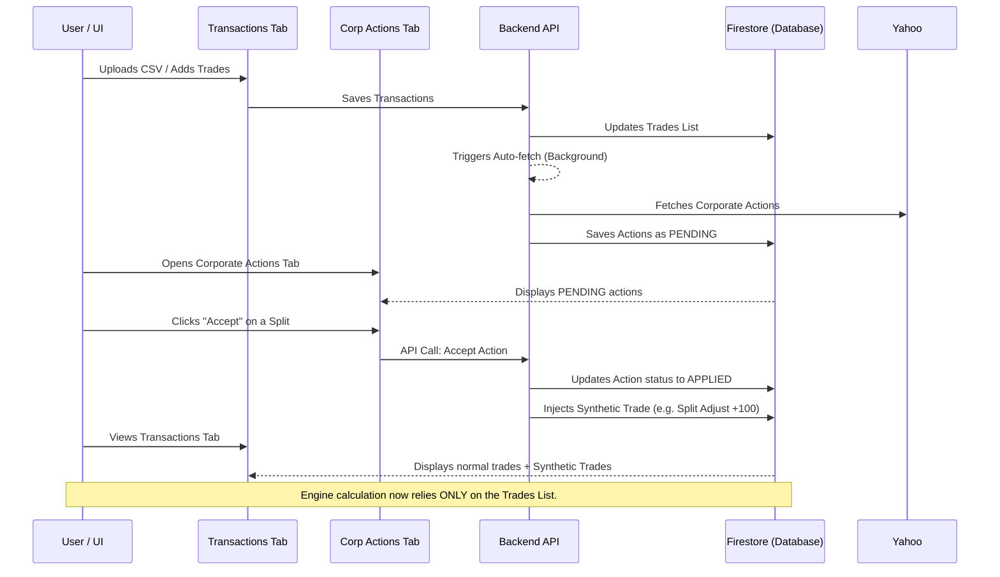

# Comprehensive Implementation Plan

This document outlines the proposed changes for two major feature overhauls: the **Corporate Actions Refactor** and the **Holdings Statement Updates**.

---

# Part 1: Corporate Actions & Portfolio Engine Refactor

This section outlines the changes to completely overhaul how Corporate Actions are processed, replacing the current "on-the-fly math" approach with a "Synthetic Trades" system. 

## 1. Layman's Explanation of the Current Portfolio Engine

Right now, your portfolio engine is like an accountant who reads two separate books at the same time:
1. **The Trades Book**: Where all your actual buys and sells are recorded.
2. **The Corporate Actions Book**: Where historical facts like stock splits and dividends are recorded.

When calculating the value of your portfolio on any given day in the past, the accountant (the engine) starts at day one and steps forward in time, day by day.
* When they see a **Trade** on a specific day, they add or subtract shares from your holdings and update your cash balance.
* When they see a **Corporate Action** on a specific day, they dynamically pause. If it's a split, they retroactively multiply your shares and adjust the cost you paid per share. If it's a dividend, they calculate how many shares you owned on that day, multiply it by the dividend amount, and add that to a "Total Dividends" bucket.

**The Problem with the Current Approach:**
These two books are disconnected. The Corporate Actions book mathematically modifies your portfolio in the background, but you never explicitly see a "transaction" in your history that says "You received $500 in dividends today". 

## 2. Proposed Changes: The "Synthetic Trades" Approach

To fix this, we will merge the two books. We will force the accountant to only look at the **Trades Book**. 

Whenever a corporate action occurs (like a split or a dividend), we will generate a **Synthetic Trade** and inject it directly into your Transactions list. 

### What changes for you (The User Flow):
1. **Auto-fetch on Save:** When you upload or save a new batch of transactions, the system will automatically scan for new tickers or dates and fetch the missing Corporate Actions in the background. It saves them as `PENDING`.
2. **The Action Center:** You go to the Corporate Actions tab and see a list of `PENDING` actions.
3. **Accepting Actions:** When you click "Accept" on a 2-for-1 Split, the system instantly generates a new row in your Transactions table: `Action: Split Adjust, +100 shares`. The corporate action is then moved to an `APPLIED` log for your reference.
4. **Tightly Coupled Deletions:** If you go to your Transactions tab and delete that synthetic `Split Adjust` trade, the system will automatically revert the action in the Corporate Actions log back to `PENDING`.

### What changes in the Code (The Engine Rewrite):
1. **New Trade Types:** We will update the `Trade` interface to support synthetic sides like `Split Adjust`, `Dividend Payout`, `Bonus Issue`, and `Merger Swap`.
2. **Engine Modification:** We will rip out the complex math that currently lives in the engine for applying splits and dividends. Instead, the engine will simply process synthetic trades just like normal buys and sells. 
   - A `Dividend Payout` trade will simply add cash to your `$CASH` balance.
   - A `Split Adjust` trade will simply add the extra shares to your holdings at a `$0` cost basis.

## 3. Data Flow Diagram

---

# Part 2: Holdings Statement Refactor & FIFO Realized Gains

Based on our discussion, here is the plan to update the Holdings statement to include accurate cost tracking (FIFO), Realized Gains, and comprehensive portfolio totals.

## 1. Engine Updates (`src/lib/advancedEngine.ts`)

To calculate Realized Gains correctly according to your tax requirements, we must rewrite the engine to use **First-In-First-Out (FIFO)** logic instead of the current Average Cost logic.

**Changes:**
- **Buy Lots Tracking:** Instead of just tracking total shares and total cost per stock, the engine will maintain an array of "Buy Lots" (e.g., Bought 10 shares at $5 on Day 1, Bought 20 shares at $7 on Day 2).
- **FIFO Selling:** When a sell occurs, the engine will deduct shares starting from the oldest Buy Lot. The cost of those specific oldest shares will be subtracted from the sale proceeds to calculate the exact **Realized Gain**.
- **Snapshot Updates:** 
  - The `DailyPortfolioEntry` will now include a running total of `realizedGains` for the whole portfolio.
  - The individual stock `holdings` record in the snapshot will include: `cost` (remaining cost basis), `unrealizedGain`, and `realizedGain` (accumulated for that stock).

## 2. UI Updates (`src/components/advanced/tabs/HoldingsTab.tsx`)

**Summary Cards (Top):**
We will add a row of large, prominent metric cards above the table showing:
1. **Total Portfolio Value** (Stocks Value + Cash Balance)
2. **Total Invested Cost** (Cost basis of all currently held active stocks)
3. **Total Unrealized Gain** (Stocks Value - Total Invested Cost)
4. **Total Realized Gain** (Accumulated profit from closed trades till date)
5. **Cash Balance** (Displayed separately)

**Main Holdings Table (Middle):**
We will update the columns of the Holdings table to exactly match your request:
- **Symbol** 
- **Price** (the closing price on the snapshot date)
- **Qty** (shares currently held)
- **Cost** (FIFO cost basis for those active shares)
- **Value** (Qty * Price)
- **Unrealized Gain**
- **Realized Gain** (Accumulated realized profits specifically for this active stock)

**Closed Positions View:**
Since some stocks might be fully sold (0 shares left) but have generated significant realized gains, they won't appear in the "Active Holdings" table. 
- We will add a toggle/button: **"Show Closed Positions"**.
- This will reveal a secondary table showing stocks with 0 shares but non-zero Realized Gains.

**Totals Row (Bottom):**
A sticky `<tfoot>` row at the bottom of the active holdings table that sums up the `Cost`, `Value`, `Unrealized Gain`, and `Realized Gain` columns.

---

## User Review Required

> [!WARNING]  
> **Engine Rewrite:** Removing the dynamic split adjustments from the engine means the math will rely entirely on the exact synthetic trades generated. If a user accidentally modifies the synthetic trade's quantity in the UI (e.g. changes +100 split shares to +50), the math will be wrong, and the engine won't auto-correct it. We will lock synthetic trades from being edited (they can only be deleted, which reverts them to PENDING).
> 
> **FIFO Conversion:** The change from Average Cost to FIFO is a deep mathematical shift. Ensure your CSV trade uploads are chronologically correct, as FIFO depends heavily on the exact order of buys and sells.

Are you ready to approve this combined architectural shift?
